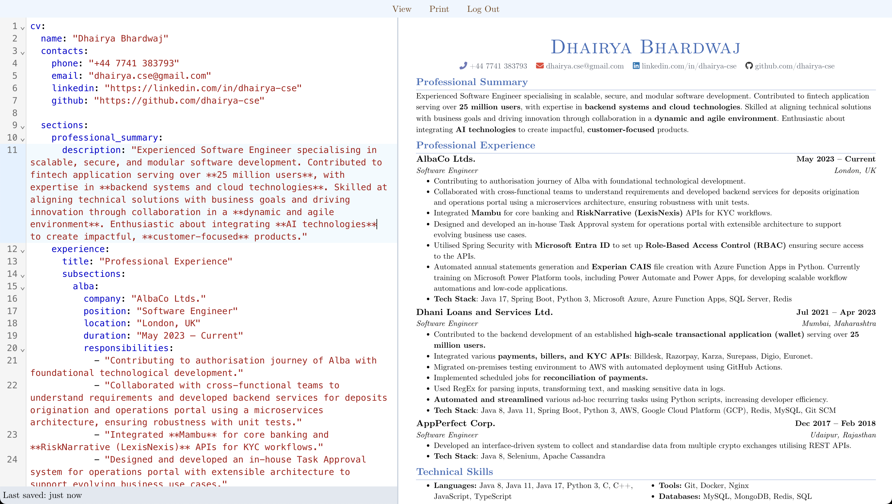

# Yaml2cv

### Introduction

Yaml2cv is personal project that streamlines cv creation using yaml and powerful CSS properties for print media.



### Purpose and Inspiration

Formatting cv to make it look nicer is a hard and word is a terrible software to do it! 

Previously I had a great template in LaTeX where I could use some custom commands to create the cv that is not terrible to look at. While I really loved the pdf generated from this template, I felt using LaTeX is a bit of overkill and it looks a bit clunky.

In one of the professional situation, I had to generate PDFs for account statements. I utilised [iText](https://mvnrepository.com/artifact/com.itextpdf/html2pdf) for converting an html page to pdf for the task in hand. It was fun to learn to use CSS to make sure that the pdf looks nice and there aren't any unexpected breaks in paragraphs. 

This inspired me to make a very simple application that utilises the print media related CSS properties to create the cv in pdf format.

**Feel this can be useful for you?! Start using it at: [cv.jinsil.me](https://cv.jinsil.me)!**

### Technology

This project utilises React for reusable components creation and tailwind for styling. While it is possible to do it with a standalone command, I have decided to make it more fun and create a web page with live editing feature.

### Configurations

There are some default configurations specified by `./data/config/config.yaml` file which would be used for every cv file.

The configs can also be overridden by defining them in your `cv.yaml` file.

Please look for the comments in the following config file to get an understanding of it.

```yaml
config:
  contacts:
    # Specify the icon and icon color for the contacts entry
    phone:
      icon: "fas fa-phone-alt"
      color: "#6e7abb"

  sections:
    # Specify the field maps for the subsections of that particular section so that they can appear as the following layout
    # title             rhsTop
    # subtitle       rhsBottom
    # - bullet 1
    # - bullet 2

    experience:
      field-map:
        title: company
        subtitle: position
        rhsTop: duration
        rhsBottom: location
        # bullets 
        bullets: responsibilities

    education:
      field-map:
        title: institution
        # You can also use templates like this to combine two fields  
        subtitle: "{{degree}}, CGPA: {{cgpa}}"
        rhsTop: year
        rhsBottom: location

    # Applying column layout to the section bullets. Maximum supported value is 3!
    technical_skills:
      bullets_cols: 2
```

### Cv file
The cv file for a user is stored at `./data/profiles/<profile-name>/cv.yaml`. 

For a new user the file is created from a template defined in `./data/config/default-cv.yaml`

Please look for the comments in the following cv.yaml file to get an understanding of it.
```yaml
cv:
  name: "Someone Surname"
  contacts:
    # phone is reserved for mobile phone to add a link appropriate to it(tel:phone_number) in the cv header
    phone: "+44 9999 99999"
    # email is reserved for emails to add a link appropriate to it(mailto:email_id) in the cv header
    email: "someone@mail.com"
    linkedin: "https://linkedin.com/in/someone"
    github: "https://github.com/someone"
    something_else: "https://something-else.com/"

  sections:
    # if title is not passed to the section, the key of the section is used as title after converting it to Title Case.
    # A section with only description
    professional_summary:
      description: "Experienced Software Engineer specialising in scalable, secure, and modular software development"
    # A section with subsections
    experience:
      title: "Professional Experience"
      subsections:
        alba:
          company: "Something Industries"
          position: "Software Engineer"
          location: "London, UK"
          duration: "May 2023 – Current"
          responsibilities:
            - Collaborated with someone else at some projects utilising some technology that resulted in 9% improvement in operational efficiency.

    technical_skills:
        bullets:
            # You can use a dictionary for the bullets, It will appear as "**Key**:value"
            languages: "c, c++, java"
    misc:
        bullets:
            # it supports markdown for adding link and simple typography!!
            - "**Personal Interests:** Music"        


# Config overrides
config:
    technical_skills:
      bullets_cols: 3
```

### Default Profile:
The default user for the site can be specified using `${DEFAULT_PROFILE}` environment variable. What that means is `http://localhost:3000/` would be redirected to `http://localhost:3000/<DEFAULT_PROFILE>`.

### Self hosting

1. Clone this project and build the container for yaml2cv with docker. (Make sure you have docker installed)

```sh
docker build -t yaml2cv .
```

2. Create an OAuth client on your keycloak realm for yaml2cv
3. Run the container
```sh
docker run -p 3000:3000 \
-e DEFAULT_PROFILE=dhairya \
-e AUTH_KEYCLOAK_ID=<your_keycloak_client_id> \
-e AUTH_KEYCLOAK_SECRET=<your_keycloak_client_secret> \
-e AUTH_KEYCLOAK_ISSUER=<your_keycloak_realm_issuer_url> \
-e AUTH_SECRET=<auth_secret> \
yaml2cv:latest
```

or alternatively, you can provide the environment variables using `--env-file` option. 
you can also mount a volume to /app/data/profiles for storing the files permanently.

```sh
docker run -p 3000:3000 --env-file .env -v yaml2cv_profiles_data:/app/data/profiles -d  yaml2cv:latest
```
4. Check `http://localhost:3000`.

### Known limitations
- Currently there are some issues with the rendering which splits one line half way but only in rare cases. A workaround is to change the font size slightly or try adding some blank spaces for now.
- Only one cv file per user that is stored on the hosted service.
- Only keycloak OAuth is supported and no bypass available for local deployments.

### Future Possibilities
- Allowing multiple file per user
- Improve error handling
- Allowing zoom separate zoom control on the cv preview and the yaml editor.
- File versioning.
- Responsive UI for smaller screens
